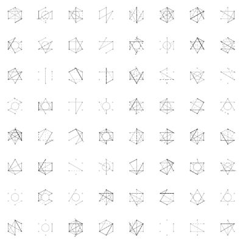
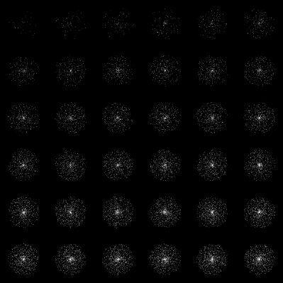

# Grid API

&nbsp;&nbsp;&nbsp;&nbsp;&nbsp;&nbsp;&nbsp;&nbsp;&nbsp;&nbsp;

A common feature of sketches (at least of [fiskurgit](https://github.com/fiskurgit)'s) is to have random variants of some code displayed in a two dimensional grid.

Initialise a grid using a class default constructor (or manage this yourself using `grid.addOccupant(someObject)`):

```kotlin
override fun setup() {
    grid.prepopulate(BasicCell::class)
}
```

Utility methods for working with cells:
* Cell diameter: `val cellDiam = grid.cellDiam()`
* Origin screen coordinates: `val originPVector = grid.cellOrigin(index)`
* Get cell at screen coordinates: `val cell = grid.occupantAt<BasicCell>(mouseX, mouseY)`


The grid default is 8x8, override this in your sketch settings:

```kotlin
override fun settings() {
    size(600, 600)
    grid.columns = 4
    grid.rows = 4
    super.settings()
}
```

Update each cell in a grid during redraw:

```kotlin
override fun draw() {
    background(BLACK)

    grid.occupants<BasicCell>().forEachIndexed { index, cell ->
        cell.draw(this, grid.cellOrigin(index), grid.cellDiam())
    }
}
```

A cell can be anything at all, but here's a simple example to give an idea:


```kotlin
import prockt.KApplet
import prockt.circle
import processing.core.PVector

class BasicCell {

    fun draw(kappl: KApplet, origin: PVector, diam: Float, color: Int){
            kappl.fill(color)
            kappl.circle(origin.x, origin.y, diam)
    }
}

```
