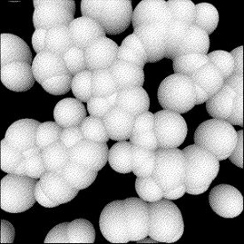
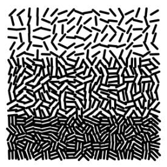
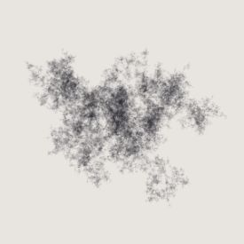
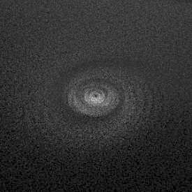

# ProcKt Template for Jetbrains IDEA

A simple (and completely unofficial) [Kotlin](https://kotlinlang.org/) wrapper for [Processing](https://processing.org/). Clone, open in [Jetbrains IDEA](https://www.jetbrains.com/idea/), and start sketching. Use with [ProcKtPlugin](https://github.com/fiskurgit/ProcKtPlugin) for easier and quicker sketch developing.

## Usage

Launch a sketch using one of the following:
* The default run configuration displays the menu below, enter a sketch number in the terminal.
* Enter a sketch number as an program argument in the run configuration (to run the same sketch every time).
* [Install the plugin](https://github.com/fiskurgit/ProcKtPlugin) (to hop between sketches while coding).


This is just a personal project I use for my own sketches, not a whole lot of thought has gone into it.

## FAQ

* _Why don't you..._ - see above
* _Why do you..._ - see above
* _You should..._ - see above
* _Can you..._ - see above
* _This is terrible_ - see above

```
class Sketch: KApplet() {

    override fun settings() {
        size(600, 600)
        super.settings()
    }

    override fun draw() {
        background(BLACK)
        stroke(WHITE)
        line(0, 0, width, height)
    }
}

```

## Note.
Processing requires JDK8, OpenJDK is fine: `brew cask install adoptopenjdk8`

## Examples

See [sketches](https://github.com/fiskurgit/ProcKtTemplate/tree/master/src/prockt/sketches).



## Licence

The Processing core libraries are distributed under a [GPL licence](https://github.com/processing/processing/blob/master/license.txt) -  [this project is too](LICENSE.md).

## Additions

This project adds a few convenience features to the standard Processing experience:

* Dithering algorithms, I've included a port of [DitherKt](https://github.com/fiskurgit/DitherKt) that works with Processing, see [Sketch012](https://github.com/fiskurgit/ProcKtTemplate/blob/master/src/prockt/sketches/Sketch012.kt)
* _Command-S_ on OSX will show a save dialog for a screenshot (note. may appear behind sketch window).
* _Command-P_ on OSX will show a save dialog for a vector pdf export when `startPdf()` and `endPdf()` have been wrapped around a drawing block (note. may appear behind sketch window).
* A simple [grid api](GRID.md) for managing two dimensional grids in sketches

